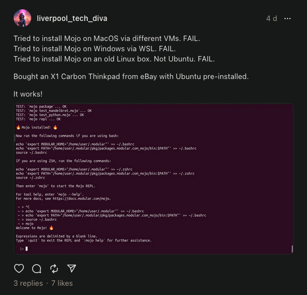

<br>

# Python To Mojo

Python code snippets with their Mojo equivalents.

<br>

## Mojo Playground

A Mojo programming environment is available from the Mojo product [page](https://www.modular.com/mojo).

<br>

## Local installation

At the time of writing, Mojo is only available for [local installation](https://youtu.be/knGTSXe7ytI?si=mGdZzrcLsZeoR5Bs) on Ubuntu-based linux distros.

In theory, you should be able to get it up and running inside a virtual machine on a different host OS, but personally, I gave in and ended up using a bare metal Ubuntu install for the x86_64 architecture.

<br>



<br>

## Editor recommendation

Due to the Mojo ecosystem being in its infancy right now, I recommend using VSCode as your editor, with the [Error Lens and Mojo extensions installed](https://youtu.be/KYEAiTBbNT8?si=_jTQnoe3cj3ViLYB).

<br>

## Shell aliases

To save time building and running my Mojo code, I have added some aliases to my .bashrc file.

```
# MOJO ALIASES
alias mbr='mojo build app.mojo && ./app'
alias mba='mojo build app.mojo'
alias mra='./app'
```

<br>

## AI Code Generation

Large Language Models (LLMs) are only effective for me because I don't trust their output.

I always test the code that they generate!

However, given that Python3 is a mature language that is fairly popular in academia and industry, there is a suprising amount of training data for them to work with.

Once you have generated the code that you want in Python3, manually making the changes required to turn it into valid Mojo code is not so hard.

<br>

## Function Generation With LLMs

I have had good results with prompts using the following template

```
Write a [name] function in Python3 that takes
[name the parameters and their types] and returns
a [type] such that [describe what the function does].
Then show me the code.
```

<br>
